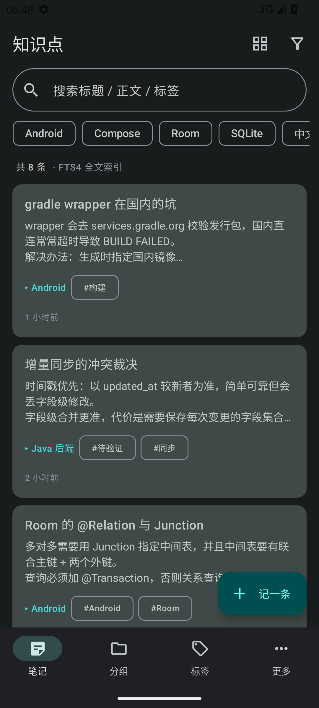
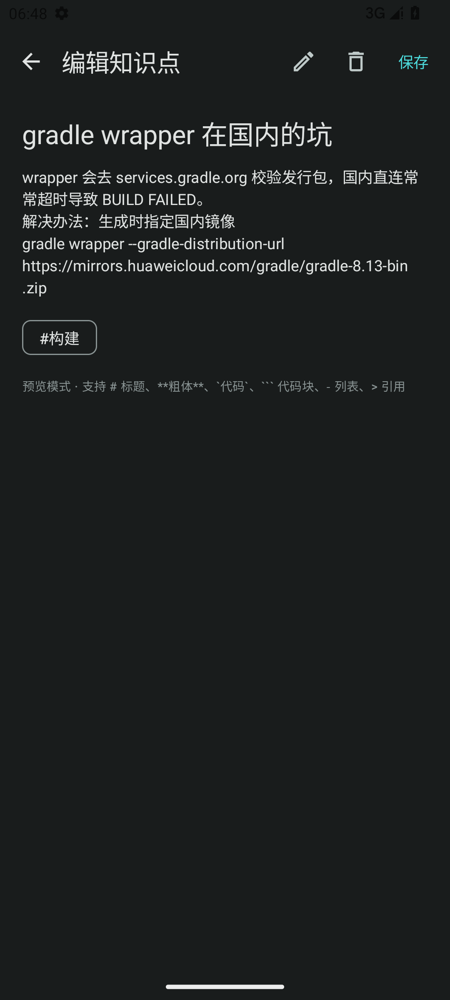
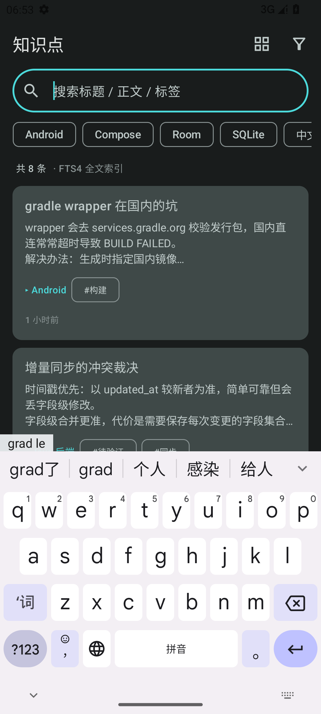
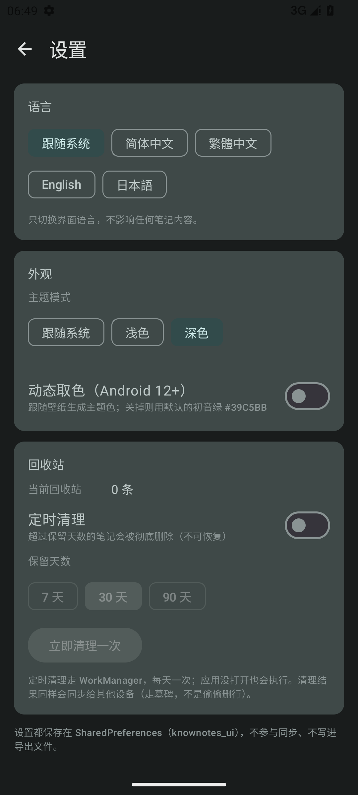
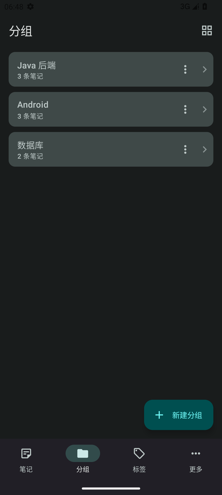
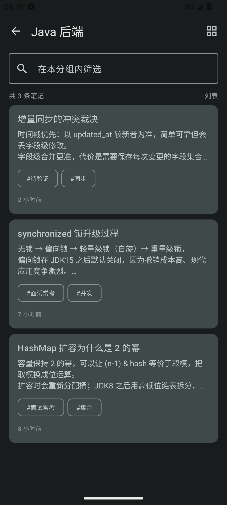
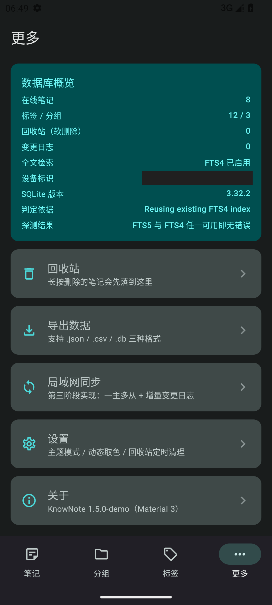
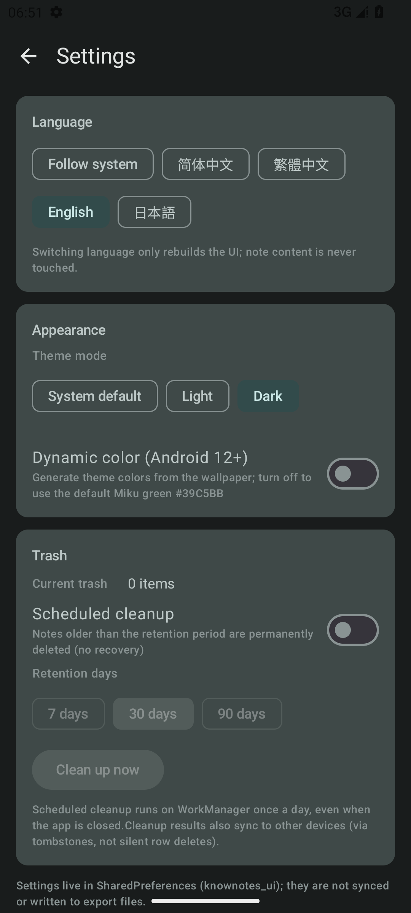

# KnowNote

**English** · [中文](README.md)

An Android notebook for small, scattered knowledge — the kind of thing you jot down in ten seconds and need to find again six months later.

Notes + tags + groups, full-text search over the note body, Markdown preview, a trash bin with scheduled cleanup, and **LAN sync between your own devices** — no account, no server, no cloud.

| | |
| --- | --- |
| **Language** | Kotlin 2.0 · Jetpack Compose · **Material 3** |
| **Data** | Room (SQLite) + FTS5 / FTS4 / LIKE three-level fallback |
| **Architecture** | MVVM + Repository, manual DI (`AppViewModelProvider`) |
| **SDK** | minSdk 26 · targetSdk 36 |
| **UI languages** | 简体中文 · 繁體中文 · English · 日本語 |

> 界面截图见 [`docs/screenshots/`](docs/screenshots/)（模拟器 + 演示数据；同步页的共享密钥 / 设备标识 / 局域网地址已打码）

## What it does

- **Notes with real search.** Chinese substring search that actually works (see *The FTS5 story* below), tags folded into the index, hit highlighting, search history.
- **Search you can aim.** Limit a query to title, body or tags (all three by default); the candidate set widens automatically when you narrow, so filtering never hides results.
- **Case-insensitive everywhere.** Index and query both fold with `lowercase(Locale.ROOT)`, so `Android`, `android` and `GRADLE` hit the same note; search history merges duplicates case-insensitively too.
- **Reading display.** Five text sizes (the whole Typography scales proportionally, so the heading/body hierarchy survives) and seven text colours with separate light and dark values.
- **Three ways to organise.** Tags, groups, and combined filtering; tapping a tag or group opens a dedicated page with the same card layout and list ↔ staggered-grid toggle.
- **Never lose a note.** Long-press deletes, everything lands in Trash first, and cleanup is opt-in: WorkManager runs once a day, keeps 7/30/90 days, and reports back what it removed.
- **Reads like notes should.** Tap = preview (Markdown rendered), long-press = edit. Only saves when you actually changed something.
- **Sync between your own devices.** One device hosts, the others pull: incremental changes via a change log + watermark, timestamps decide conflicts, ties converge deterministically.

## Screenshots

| Notes | Editor | Search | Settings |
| --- | --- | --- | --- |
|  |  |  |  |

| Groups | Group detail | Stats | English UI |
| --- | --- | --- | --- |
|  |  |  |  |

## Build & run

```bash
# JDK 17 + Android SDK (point local.properties at your SDK; it is not committed)
./gradlew :app:assembleDebug            # app/build/outputs/apk/debug/app-debug.apk
./gradlew :app:installDebug             # install on a connected device
./gradlew :app:testDebugUnitTest        # unit tests (8)
./gradlew :app:connectedDebugAndroidTest # instrumented tests (35)
```

> The wrapper's `distributionUrl` points at a Huawei mirror — `services.gradle.org` times out on
> direct connections from mainland China. Regenerate with
> `gradle wrapper --gradle-distribution-url https://mirrors.huaweicloud.com/gradle/gradle-8.13-bin.zip`

## Architecture

```
data/model/Entities.kt       notes / tags / groups / note_tags / sync_meta / change_log / search_history / sync_log
data/db/AppDatabase.kt       8 tables (schema v3) + MIGRATION_1_2 / 2_3 + FTS bootstrap & self-healing
data/db/FtsStore.kt          virtual-table DDL, engine probing, MATCH queries, index rebuild
data/fts/FtsText.kt          tokenisation and MATCH expression building (the key to Chinese substring search)
data/repo/NoteRepository.kt  the only write path: note + relations + FTS index + change log in one transaction
data/export/Exporter.kt      JSON / CSV / SQLite (VACUUM INTO) export through SAF
data/sync/…                  wire format, engine, hand-written HTTP server, client, coordinator
data/settings/AppSettings.kt reactive settings (theme / dynamic colour / trash cleanup / language)
ui/…                         Compose screens + ViewModels
```

## Two Android platform gotchas worth knowing

Both found on a real device, both fixed in the code rather than worked around.

**1. Android's bundled SQLite does not guarantee FTS5.** On Android 15 / SQLite 3.44.3, `fts5` reports
`no such module`. The app therefore probes for capability and falls back FTS5 → FTS4 → LIKE, showing the
active engine in the UI so degradation is never silent.

The trap: you cannot probe with `CREATE VIRTUAL TABLE IF NOT EXISTS … USING fts5`, because when a table
of that name already exists SQLite skips module loading and reports success — the app then believes it has
FTS5 and every `bm25()` query returns nothing. The fix is to judge by *behaviour*: try a `MATCH` to see
whether the module is there, use `bm25()` to tell FTS5 from FTS4, and keep all probing inside `temp.`
tables so a failed `CREATE` can never leave debris behind.

**2. FTS4 without `SQLITE_ENABLE_FTS3_PARENTHESIS` treats `AND` as a literal token.** `"检 索" AND "零 碎"`
matches nothing. The app uses whitespace as implicit AND instead — valid on both FTS4 and FTS5.

For Chinese, `unicode61` treats a run of Han characters as one token, so searching 「检索」 never finds
「全文检索」. Rather than shipping a dictionary segmenter, the index stores a per-character copy of CJK
text (`全文检索` → `全 文 检 索`) and queries turn adjacent CJK into a phrase, so substring matching works
with the stock SQLite.

## LAN sync

Host device runs an embedded HTTP server (default port 8765); clients fill in *address + shared key* and
press sync. One request carries both directions.

- `GET /ping` — reachability probe, no key required, returns `{protocol, device_name}`. Exists so you can
  tell "wrong address" apart from "wrong key".
- `POST /sync` — `X-KnowNote-Key` header, request carries the client's watermark + its own changes,
  response carries the host's changes.

The wire format never contains local row ids: notes are identified by a `guid`, groups and tags by **name**,
so no id-mapping table is needed. Incremental sync rides on a change log plus a watermark; after a
successful sync the watermark becomes `min(host clock, local clock)` so clock skew can only cause a
redundant re-send, never a missed change. Conflicts go to the newer `updated_at`; equal timestamps resolve
to the larger canonical string so both sides converge instead of fighting forever.

**"Delete permanently" leaves a tombstone** (`is_purged = 1`) rather than removing the row — otherwise the
other device would happily sync the note back.

**Security boundary, stated plainly:** the key decides *who may sync*, not *who can read*. Transport is
plain HTTP on the LAN, and a host without a key refuses to start. Requesting a note from someone on the
same Wi-Fi is possible; hiding its content until TLS lands is not. The host also has no foreground
service in this version, so the process can be reclaimed by the system.

## Verification

| Check | Result |
| --- | --- |
| `assembleDebug` / `assembleRelease` | BUILD SUCCESSFUL |
| Unit tests | 8/8 |
| Instrumented tests (Android 13 / SQLite 3.32.2) | **35/35** |
| Instrumented tests (Android 15 / SQLite 3.44.3) | **35/35** |
| Migration tests | 1→2 (adds `search_history`), 2→3 (`guid` backfill via `randomblob(16)`, `is_purged`, `sync_log`), 1→3 jump; each validated against the exported Room schema |
| Real-device sync loopback | real `ServerSocket` + real `HttpURLConnection`, two independent databases, two-way sync, wrong key → 401 |
| Multi-language | switching to English/Japanese re-renders the whole UI, numbers included; system per-app locale stays in sync |

## Version history

| Version | Notes |
| --- | --- |
| v1.0.0 | First working version: notes, tags, groups, FTS with fallback, export, trash |
| v1.0.1 | Fixed FTS engine mis-detection; repeat probing is now idempotent |
| v1.1.0 | Markdown rendering, edit ↔ preview, search history, filter memory, trash; database migration 1→2 |
| v1.1.1 | Fixed tags typed but not confirmed being dropped; tap = view / long-press = edit; list ↔ staggered grid |
| v1.2.0 | Tag and group entries open their notes (first attempt: inline expansion) |
| v1.2.1 | Second-level pages instead: `group/{id}` and `tag/{id}` routes, own filter box, same cards; fixed a real bug where merely previewing a note bumped `updated_at` |
| v1.3.0 | LAN sync: host + clients, hand-written HTTP server, incremental changes, deterministic conflict resolution, shared-key auth; database migration 2→3 |
| v1.4.0 | Settings page (theme mode, dynamic colour, scheduled trash cleanup); overview counters became Room Flows so they update live |
| v1.5.0 | Four UI languages with per-app locale support; renamed to **KnowNote / 碎片笔记**; adaptive icon with a proper monochrome layer; internal diagnostics unified to English. Also fixed a bug only visible on a device: Kotlin templates in *translations* were written into resources verbatim, so the Japanese UI showed `$days 日` |
| v1.6.0 | Adjustable reading display (five sizes, seven text colours) and a search you can aim (title / body / tags, all by default; case-insensitive everywhere). The text colour has to be applied to **theme colour roles**, not `LocalContentColor` — 60+ Texts set an explicit colour, so only roles take effect |

## Roadmap

1. **Harden sync** — foreground service with a persistent notification for the host, TLS or a pre-shared
   key for confidentiality, optional static addressing instead of typed-in IPs.
2. **Device discovery** — NSD/mDNS so the address box is not needed.
3. **Conflict UX** — list which notes were resolved (and offer a "see the other side" view).
4. **Export** — range selection (group/tag/time) and import.
5. **Tombstones** — purge tombstones once every peer's watermark has passed them.

## License

[MIT](LICENSE) — use it, change it, ship it; just keep the copyright notice.

---

Built with Kotlin, Compose and a lot of on-device testing — every "verified" row above was run on a real
phone, not just in CI.
