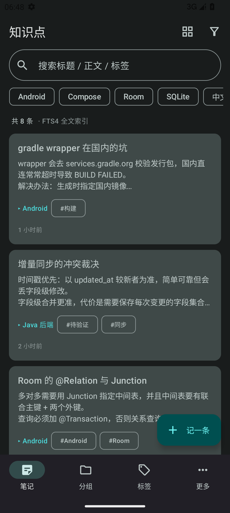
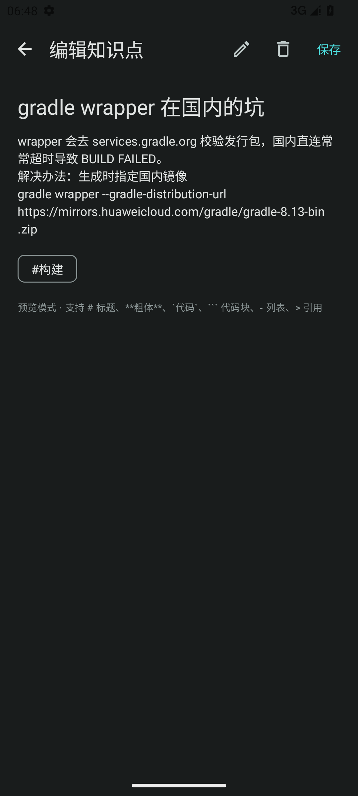
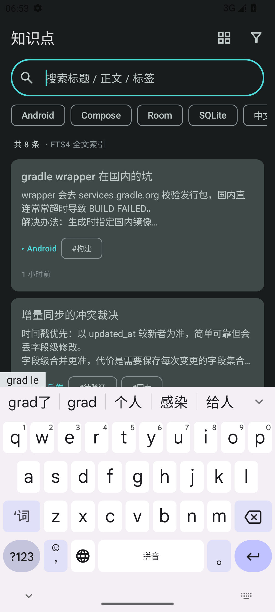
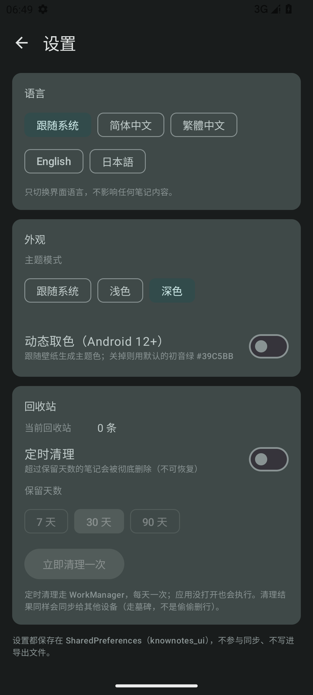
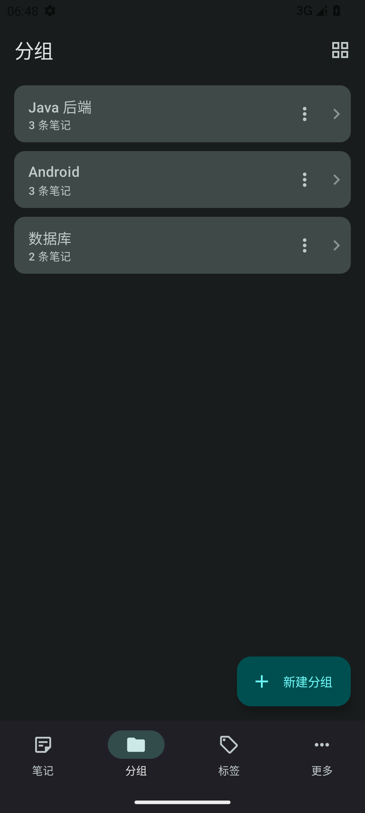
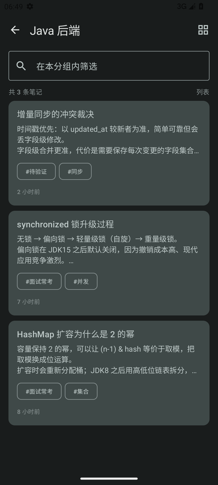
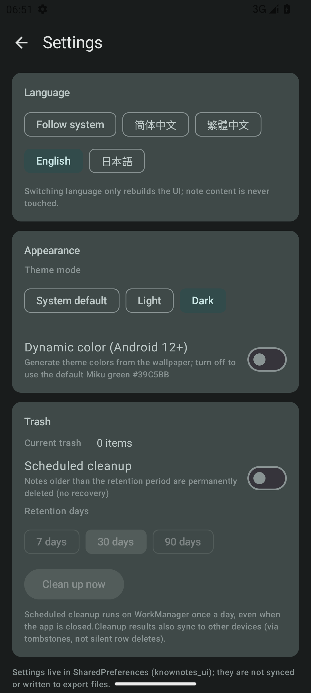

# KnowNote

**English** · [中文](README.md)

An Android note-taking app. Kotlin + Jetpack Compose + Material 3, Room(SQLite) with full-text search
(FTS5 / FTS4 / LIKE three-tier fallback), MVVM + Repository. Devices sync with each other over the local
network; an optional sync hub (plain Python 3 standard library) runs on Termux or a PC.

| Item | Value |
| --- | --- |
| Package | `com.xinjigalaxy.knownotes` (debug variant gets a `.debug` suffix) |
| SDK | minSdk 26 / targetSdk 36 / compileSdk 36 |
| UI languages | follow system / Simplified Chinese / Traditional Chinese / English / Japanese |
| Theme | seed color `#39C5BB`, Android 12+ dynamic color |
| Sync protocol | **3** (app and hub must be upgraded together) |

## Overview

A local-first Android note app: notes, tags, groups, Markdown rendering, full-text search, inline images and
trash all work offline. Syncing uses an embedded HTTP service on the local network — no account, no cloud.
An optional sync hub implemented purely with the Python 3 standard library can host the scheduled sync jobs
on an always-on machine.

## Highlights

- **Local-first**: data lives in the app's private directory; no account, no upstream service
- **Three-tier search fallback**: FTS5 → FTS4 → LIKE, chosen from the system SQLite's capabilities; the active engine is visible in the UI
- **Chinese substring search**: CJK is split per character on write and phrased on query — no jieba dependency
- **Two-way inventory diff sync**: the delta comes from "what each side has", not from a watermark; bodies travel only when the peer names them
- **Sync hub**: zero dependencies, zero compiling; works as a host and can poll devices on its own
- **LAN-only**: client, host and hub all refuse non-LAN sources at their single entry point
- **Tunable reading**: five font sizes, seven text colors, inline formatting (bold / italic / size / six colors), inline images
- **Four languages + Material 3**: dynamic color, light/dark themes, per-app language

## Screenshots

<a href="docs/screenshots/01-notes-list.png"></a>
<a href="docs/screenshots/02-note-preview.png"></a>
<a href="docs/screenshots/03-search.png"></a>
<a href="docs/screenshots/07-settings.png"></a>

<a href="docs/screenshots/04-groups.png"></a>
<a href="docs/screenshots/05-group-detail.png"></a>
<a href="docs/screenshots/08-settings-dark.png"></a>
<a href="docs/screenshots/10-english-settings.png"></a>

Taken on an emulator with demo data; the sync screen's key, device id and LAN address are masked.

## Features

### Notes

- Create / edit / soft delete / restore / purge (tombstone); a delete from the list can be undone
- Markdown rendering: headings / bold / italic / strikethrough / inline code / code blocks / lists / quotes / tappable links; edit ↔ preview toggle
- Interaction: tap = view, long-press = edit, new note from the FAB
- Inline images: picker (no storage permission) → copied into the private directory (scaled to 1600px, re-encoded JPEG) → body stores ``; images take a full row
- List ↔ staggered grid toggle, shared by the notes / group / tag / detail screens

### Search

- Engines: FTS5 → FTS4 → LIKE fallback; Chinese substring hits, prefix matching, tags indexed, highlighted results
- Scope: title / body / tags can be toggled individually (all on by default; selecting none restores all)
- Filters: keyword + multiple tags + group (all / ungrouped / specific)
- Case: both index and query use `lowercase(Locale.ROOT)`; history merges case-insensitively
- History: up to 12 entries, deletable individually or cleared; filters persist in SharedPreferences
- The index is rebuilt whenever its row count disagrees with the live note count

### Organisation

- Tags: create / rename / delete / merge into; tapping an entry opens a detail screen
- Groups: create / rename / delete (keep notes or delete them) / reorder; tapping an entry opens a detail screen
- Detail screens: `group/{groupId}`, `tag/{tagId}` routes with their own filter box, status line and the same cards
- Trash: restore / purge / empty; scheduled cleanup (WorkManager, daily; retention 7 / 30 / 90 days)

### Sync

- One host, many clients: the host runs an embedded HTTP service (default 8765); clients enter "address + shared key"; one request syncs both directions
- Scheduled sync has two paths: device-side WorkManager (15 / 30 / 60 / 180 minutes) and hub-side polling
- Log: `sync_log` records role / peer / pulled / pushed / conflicts / failure reason, shown in the sync screen and clearable
- Cross-device identity: `notes.guid`; groups and tags are matched by name, so no id mapping table is needed
- Deletions propagate as tombstones (`is_purged`), otherwise the peer would push the note back

### Appearance and settings

- Theme mode follows system / light / dark, re-skins the whole tree immediately; dynamic color (Android 12+, greyed out with an explanation below that)
- Reading: five font sizes (the whole Typography scales proportionally), seven text colors; the reader's own slider adjusts size (0.8×–1.8×, multiplier-based)
- Reader modes: rendered Markdown / raw text (raw shows `<color>` / `<size>` markers verbatim)
- Inline formatting on a selection: bold / italic / three sizes / six colors, stored as markers in the plain-text body
- Languages: API 33+ uses the system's per-app language, older versions wrap `Configuration`

### Engineering

- Database `user_version` migrations 1→2→3, ALTER / CREATE only, no table rebuilds; `MigrationTest` validates against the exported schema JSON
- Export `.json` / `.csv` (BOM) / `.db` (`VACUUM INTO` snapshot) through SAF, no storage permission needed
- The "More" screen's counters are Room flows, so any write updates them automatically
- Launcher icon is an adaptive icon with a separate monochrome layer (Android 13+ themed icons)

## Getting started

| Item | Notes |
| --- | --- |
| Requirements | Android 8.0 (API 26) or newer |
| Build | JDK 17 + Android SDK; `local.properties` points at your SDK (not tracked) |
| Install | Download the APK from [Releases](../../releases), or run `./gradlew :app:installDebug` |
| Sync hub | `server/knownote_hub.py`, Python 3 standard library only |

```bash
export JAVA_HOME="/path/to/jdk17"
./gradlew :app:assembleDebug               # output: app/build/outputs/apk/debug/app-debug.apk
./gradlew :app:installDebug                # install to a connected device

python server/knownote_hub.py --init-config server/hub.conf.json   # generate a config (random key)
python server/knownote_hub.py --config server/hub.conf.json        # run (also polls devices)
```

The Gradle wrapper's `distributionUrl` points at a Huawei mirror because `services.gradle.org` times out from
mainland China. To regenerate it:

```bash
gradle wrapper --gradle-distribution-url https://mirrors.huaweicloud.com/gradle/gradle-8.13-bin.zip
```

**This repository ships program source only**: development scripts, unit / instrumented tests and the demo
seeding script are not included (`tools/`, `app/src/test`, `app/src/androidTest`, `app/schemas`, `server/tests`
were removed from the repository and its history; they stay on the author's machine). The verification logs
below are the results those tests produced.

## Code map

```
data/model/Entities.kt       notes / tags / groups / note_tags / sync_meta / change_log / search_history / sync_log
data/db/AppDatabase.kt       8 entity tables (v3); FtsSchemaCallback wires FTS creation and self-healing; MIGRATION_1_2 / 2_3
data/db/NoteDao.kt           note CRUD, soft delete, tombstones, LIKE fallback, group / tag counts
data/db/MetaDaos.kt          tags (incl. merge), groups (incl. ordering), change log, sync metadata, sync log
data/db/FtsStore.kt          virtual-table DDL / engine probing / MATCH queries / index rebuild
data/fts/FtsText.kt          tokenisation and MATCH expression building
data/repo/NoteRepository.kt  the only write entry point: main table + relations + FTS index + change log in one transaction
data/export/Exporter.kt      JSON / CSV / SQLite export
data/sync/SyncModels.kt      wire format + JSON codec
data/sync/SyncDiff.kt        pure functions for the inventory diff (protocol 3)
data/sync/SyncEngine.kt      local inventory / changes, applying remote changes
data/sync/SyncServer.kt      host side: hand-written HTTP server (ServerSocket) + LAN address enumeration
data/sync/SyncClient.kt      client side: HttpURLConnection + address parsing
data/sync/SyncCoordinator.kt one sync session: diff → fetch bodies → apply → log (serialised)
data/sync/AutoSync.kt        scheduled sync: WorkManager periodic work + scheduling / cancelling
data/sync/LanGuard.kt        LAN boundary: address classification + network type check (injectable for tests)
server/knownote_hub.py       sync hub: protocol 3 host side + device polling + SQLite / images
server/start-hub.sh          Termux launcher (daemonise / wake-lock / check / status / log)
ui/…                         Compose screens + ViewModels (hand-wired AppViewModelProvider)
ui/components/UiMessage.kt   localisable messages from the ViewModel layer (resource id + args)
data/settings/AppSettings.kt app settings (theme / dynamic color / trash cleanup / language) as a StateFlow
data/settings/AppLocales.kt  locale handling: API 33+ uses LocaleManager, older versions wrap Configuration
res/values{,-zh,-zh-rTW,-ja}/strings.xml  four-language resources
```

## Android platform notes

**The system SQLite has no FTS5.** Measured on Android 15 (SQLite 3.44.3):

```
sqlite=3.44.3 | FTS5=no such module: fts5 (code 1 SQLITE_ERROR) | FTS4=OK
```

Hence capability probing plus a three-tier fallback, with the active engine shown in the list status line and
on the "More" screen.

Probing must not use `CREATE VIRTUAL TABLE IF NOT EXISTS ... USING fts5`: when a table of the same name already
exists SQLite skips module loading and reports success, so the engine is misdetected as FTS5 and any use of
`bm25()` (unsupported by FTS4) matches nothing. The code now reads the real DDL from `sqlite_master` first.

**FTS4 has no explicit `AND`.** Without `SQLITE_ENABLE_FTS3_PARENTHESIS`, `AND` is treated as a term, so
`"检 索" AND "零 碎"` never matches. The code uses implicit AND via whitespace (`"检 索" "零 碎"`), which both
FTS4 and FTS5 accept.

**Chinese tokenisation (`FtsText`).** Both unicode61 and simple treat a run of CJK as a single token, so
"检索" does not match "全文检索" — only prefix matching works.

- On write: CJK is split per character (`全文检索` → `全 文 检 索`); Latin words stay whole and lower-cased
- On query: consecutive CJK becomes a phrase (`"检 索"`, adjacency means substring), Latin words use prefixes (`sql*`)
- The index stores the tokenised copy; display and export always use the original text

**Do not use `sqlite_master` to decide whether a virtual table exists (an actual v1.0.0 bug).** Room calls
`onCreate` and `onOpen` back to back, so `FtsStore.create()` runs twice; on SQLite 3.32 (Android 12 / 13) the
second lookup returned no DDL, so the code concluded "table missing" → retried FTS5 and FTS4, both reporting
`table notes_fts already exists` → the working engine was downgraded to NONE and search fell back to LIKE.

The v1.0.1 fix:

- With the table present, probe the module with `MATCH` and tell FTS5 from FTS4 by whether `bm25()` exists
- Probe modules through a `temp.` table, never by attempting to create the real one
- `create()` is idempotent: the second call must not change the first call's conclusion (regression test `repeatedProbeMustNotDowngradeTheEngine`)
- Any row-count mismatch with the live notes triggers a full rebuild, covering upgrades, crashes and external seeding

## LAN sync

### Topology and protocol

One device enables "host mode" (embedded HTTP service, default port 8765); the others enter "host address +
shared key" and sync. A device can hold both roles.

| Endpoint | Description |
| --- | --- |
| `GET /ping` | Connectivity probe returning `{protocol, device_name}`, **no key required** (separates a wrong address, a stopped host and a wrong key) |
| `POST /sync` | One request syncs both directions; header `X-KnowNote-Key`; the body carries this device's full inventory + changes + watermark, the response carries the host's inventory + `want_guids` + changes + counters |

The wire format carries no local ids: notes are identified by `guid` (32 hex chars), groups and tags are sent
by name and resolved or created on the other side — no id mapping table.

```json
{"guid":"a4e5f331...","title":"...","content":"...","group":"零散知识点","tags":["标签1"],
 "created_at":1700000000000,"updated_at":1700000001000,"is_deleted":0,"is_purged":0}
```

Since protocol 3 every round also carries inventory entries (identity and fingerprint only, no body):

```json
{"g":"a4e5f331...","u":1700000001000,"p":0,"h":"551d9a74"}
```

### The diff: two-way inventory comparison (protocol 3)

- Requests and responses both carry a **full inventory**: `guid` + `updated_at` + `is_purged` + `hash` (FNV-1a 32-bit fingerprint of the canonical content string)
- Both sides run the same pure function (the app's `SyncDiff` and the hub's, bit-identical between Kotlin and Python):

| Comparison | Action |
| --- | --- |
| Peer lacks it / mine is newer / timestamps tie but fingerprints differ | I send |
| I lack it / peer is newer | I ask for it |
| Identical (including the same tombstone on both sides) | Nothing moves (the source of idempotence) |

- Bodies travel only when needed: the peer names the guids it wants in `want_guids`, and the next round sends their bodies by guid; at most 5 rounds per sync
- `last_sync_at` is kept, but only as a one-round shortcut and for the UI — **correctness does not depend on it**
- When the host applies a client's change it records a change-log entry (`at` = receive time), otherwise a third client would never see the second client's edits; clients do not record

Protocol 2 → 3 is a breaking change: a v1.10.1 app and a protocol 3 hub answer each other with 426.

### Conflict resolution

1. The larger `updated_at` wins wholesale (title / body / group / tags / soft-delete / tombstone)
2. If the local copy is newer, it stays; the peer picks it up on the next sync
3. On equal timestamps with different content, both sides take the version with the larger canonical string, which guarantees convergence (a regression test asserts both ends end up identical)

### Purging is a tombstone

A purge keeps a row with `is_deleted=1 + is_purged=1` instead of deleting it; otherwise the peer would push the
note back. All lists, searches and counters filter `is_purged=1`, and the deletion propagates through timestamps.

### Security boundaries

| Item | Notes |
| --- | --- |
| Authentication | `X-KnowNote-Key` shared key with a constant-time comparison; a wrong key gets 401. The key is 8 readable characters (no `0/O/1/I/l`) and can be regenerated in the sync screen |
| Confidentiality | **None.** Plain HTTP on the LAN; a sniffer on the same segment can read note contents. Confidentiality needs TLS or pre-shared-key encryption later |
| Exposure | The host binds `0.0.0.0` but refuses to start without a key; the enabled state is stored and restored the next time the app opens |
| Source restriction | LAN-only (v1.10.1), see below. The shared key decides *who* may sync, the source check decides *from where* |
| Lifetime | The host service lives in the application scope, so navigating away keeps it; there is no foreground Service, so a recycled process stops it |

### Scheduled sync

| | Device side (`data/sync/AutoSync.kt`) | Hub side (`server/knownote_hub.py`) |
| --- | --- | --- |
| Who initiates | The phone (WorkManager wakes the process) | The hub (connects to each device every `interval_seconds`) |
| Minimum interval | 15 minutes (Android's floor), deferred under battery optimisation | Configurable, default 60 seconds |
| Requirements | Host address and key configured; the peer need not be running | The device runs host mode and its app process is alive |
| Switch | "Scheduled auto sync" card in the sync screen | `interval_seconds` in the config |

Both can be enabled at once since syncing is idempotent. Two implementation points:

- Missing configuration returns `success`, never `failure`: `failure` cancels the periodic work, so filling the address in later would never run again
- Manual and scheduled syncs share one watermark, so `SyncCoordinator` serialises sessions with a mutex

Toggling the switch performs one run immediately along the same path, which surfaces a wrong address at once.

### LAN-only (v1.10.1)

| Where | Guard location | Rule |
| --- | --- | --- |
| App client | `SyncCoordinator.syncSession` entry (shared by manual and scheduled) | Current network is not a LAN, or the peer address is not on a LAN → send nothing, log it and explain why |
| App host | First step of `SyncServer.handle` | Non-LAN source → 403 (including `/ping`), count and log it |
| Hub | `Hub.lan_check` | Non-LAN source → 403; with proxy headers the real source in `CF-Connecting-IP` / `X-Forwarded-For` must also be on a LAN. `lan_only` defaults to on |

LAN definition (identical on both sides): RFC1918 (10/8, 172.16/12, 192.168/16) + loopback (127/8) + link-local
(169.254/16), and IPv6 `::1` / `fc00::/7` / `fe80::/10`. Carrier-grade NAT `100.64.0.0/10` is **deliberately
excluded** — that is where a phone on mobile data lives.

Device side also sets a system-level constraint: the periodic work requires an `UNMETERED` network. The
constraint is fixed when the work is scheduled, so changing it requires `ExistingPeriodicWorkPolicy.UPDATE`;
`KEEP` never updates existing work.

A blocked run counts as "skipped": it logs `skipped:` and returns `success`. Returning `retry` would make the
phone back off and retry on mobile data, and `failure` would cancel the periodic work.

The hub adds a start-up guard: if `bind` resolves to public addresses only, or the machine has no LAN address at
all, it prints the reason and exits with code 2; when it cannot tell, it only warns.

The restriction covers the source subnet and the local network type only, not man-in-the-middle attacks. Using
it across networks requires turning `lan_only` off and accepting that only the shared key guards it.

### Termux sync hub (`server/`)

Two roles:

1. **Host**: `GET /ping` + `POST /sync`, identical to the app's wire format (protocol 3), so entering "hub address + key" in the app works with no code changes
2. **Poller**: connects to each configured device every `interval_seconds` (the device must run host mode)

Python 3 standard library only (`http.server` / `sqlite3` / `threading` / `base64`) — no dependencies, no
compiling; on Termux, `pkg install python` is enough.

```bash
cd server
python knownote_hub.py --init-config hub.conf.json   # generate a config (random key, usable as is)
vim hub.conf.json                                    # fill in devices: LAN IP + port + key
bash start-hub.sh bg                                 # run in the background (nohup; writes hub.pid / hub.log)
bash start-hub.sh status                             # note count and the last result per device
bash start-hub.sh check                              # connectivity probe only, no data changes
bash start-hub.sh log                                # follow the log
bash start-hub.sh stop                               # stop
```

Other flags: `--once` (one polling round, handy for cron / Termux:Boot), `--status`, `--check`, `--port`,
`--key`, `--print-key`. `hub.conf.json`, `knownote-hub.db` and `images/` are all in `.gitignore` (they hold the
key and real notes); `hub.conf.example.json` is the sample.

Limits:

- **No peer state stored**: the images a peer needs are derived from the set it advertises each round, so a hub restart, a machine swap or a wiped database does not make devices misjudge each other (the watermarks and image cache in the hub's database only save a round trip)
- **Security**: same as the app host (shared key + per-IP throttling on wrong keys + refuses to start without a key + `lan_only` on by default), plain HTTP
- **Not a cloud**: data stays on the machine running it; there is no account and no upstream service. Remote use needs your own tunnel / VPN
- **Single process**: `ThreadingHTTPServer` plus one SQLite write lock is fine for personal scale; dozens of devices would need WSGI and a connection pool

## Verification

### Features and migrations (v1.0.0 – v1.9.0)

| Check | Result |
| --- | --- |
| Build | `:app:assembleDebug` / `assembleRelease` BUILD SUCCESSFUL |
| Unit tests | 55/55 (`FtsTextTest` 8 / `MarkdownMarkupTest` 10 / `MarkupEditTest` 22 / `NoteBlocksTest` 7 / `SearchScopeTest` 8) |
| Instrumented tests | Android 13 (SQLite 3.32.2) 47/47; Android 15 (SQLite 3.44.3) 47/47 |
| `SyncEngineTest` | 8/8: remote creation (groups by name, tag links), newer timestamp wins, tie convergence, soft delete and tombstone propagation, purge leaving a tombstone that syncs out, change collection, host logs while the client does not, ignoring a tombstone for a note the device does not have |
| `SyncLoopbackTest` | 3/3: real ServerSocket + real HttpURLConnection + two separate databases syncing both ways (pull 4 push 1, then idempotent), wrong key 401, refuses to start without a key |
| `MigrationTest` | 3/3: 1→2, 2→3 (`guid` backfilled as distinct 32-hex values, `is_purged` default 0, `sync_log` writable, a duplicate `guid` rejected by the unique index) and the 1→3 jump; all three validated against the schema JSON |
| Real-device search | Chinese substring "检索" matched 2 notes, prefix `gradle*` matched 1, multi-term AND correct |
| Index self-healing | Index 0 rows after seeding → 8 rows after launch, matching the live note count |
| Engine self-healing | v1.0.0's degraded state → overwrite-install v1.0.1 → FTS4 restored with a full rebuild, all MATCH queries hit |
| Real-device migration | `user_version` steps up on overwrite install with notes and index intact; v2→v3 backfilled `guid` 3/3 distinctly |
| Real-device sync (host side / app ↔ app) | `/ping` 200; wrong key 401; correct key syncs both ways; groups and tags matched by name; watermark idempotent |
| Live counters | Deleting and purging update the "More" screen immediately while the tombstone remains |
| Languages | On an API 33 device, switching to English sets the system locale to `[en]` and "follow system" returns to `[]`; three app names read back from the APK; theme settings survive a language change |
| Theme and settings | Dark mode re-skins without recreating the Activity; dynamic color applies; the About entry reads the version from the package |

### v1.10.0 (scheduled sync + Termux hub)

| Check | Result |
| --- | --- |
| Unit tests | 55/55 |
| Instrumented tests | 47/47 on Android 13 and Android 15 (new `AutoSyncTest`, 7 cases) |
| `AutoSyncTest` | 7/7: off means nothing happens; auto sync really pulls the hub's notes (writing "last auto sync"); local edits are pushed; missing address / key returns success; hub offline returns retry; a 401 surfaces its reason; the periodic work is really scheduled and cancelled |
| Hub tests (PC) | 50/50: protocol (401 / 404 / 429 throttling / bad JSON / protocol version), engine (changes, conflict convergence, tombstones, images sent once, multiple rounds), scheduling (both directions, idempotence, failure reasons, watermark = min clock), inventory diff, persisted device state, LAN restriction |
| Hub tests (real Termux, Android 11 / Python 3.14.6 / arm64) | 50/50 straight after `pkg install python`, no root, no third-party packages |
| Cross-implementation: hub pulls the app | One `--once` round pulled 8 notes from the app and pushed 2 back; the app went 8 → 10 notes with groups and tags matched by name |
| Cross-implementation: app syncs to the hub | A note created on the hub arrived on the app (11 notes); the app pushed 10 notes and the hub applied 0 (idempotent) |
| Cross-implementation: Termux hub ⇄ PC hub | One round pulled 12 notes, the next was `0/0`; `--status` reads it from another process |
| Cross-implementation: Termux hub ⇄ real app | One round pulled 10 notes from the app; a note created on the hub was pushed into the app (12 → 13 notes) |

### v1.10.1 (LAN-only)

| Check | Result |
| --- | --- |
| Unit tests | 58/58 (new `LanAddressTest`, 3 cases) |
| Instrumented tests | 50/50 on Android 13 and Android 15 (3 new: nothing is sent when blocked, "skipped" is neither retry nor failure, the work is constrained to unmetered networks) |
| Hub tests (PC / real Termux) | 41/41 (12 new LAN cases) |
| "Not a single request" | The instrumented case asserts the host received 0 requests, rather than only checking the return value |
| Other server assertions | Note count and content hash are identical around a 403; a direct public address gets 403, a public `CF-Connecting-IP` gets 403, a multi-hop `X-Forwarded-For` only trusts the first hop, private sources pass, `lan_only:false` passes, and a public `bind` makes `main()` return 2 |
| Real tunnel control | With `lan_only:true`, a tunnel request to `/ping` returned 403 (the log records the real origin from the proxy header); with `lan_only:false` the same URL returned 200 |
| Overwrite install (tablet / Android 16) | 1.10.0 → 1.10.1 in place: every counter identical, the notes content hash unchanged, preferences and images byte-identical, `firstInstallTime` unchanged |

### v1.10.2 (two-way inventory diff)

| Check | Result |
| --- | --- |
| Diagnosis | An old device whose watermark a previous peer had already advanced computed an empty delta against a new peer, so the new peer received only a handful of notes |
| Unit tests | 62/62 (new `SyncDiffTest`, 4 cases: peer missing / local newer / tie with different fingerprint / tombstone, plus the pinned hash values) |
| Instrumented tests | 57/57 on Android 13 and Android 15 (5 new: a fresh host still receives all 5 notes when the client's watermark was advanced, a deletion travels with no pending delta, wire-struct round trip, golden-JSON contract) |
| Hub tests (PC / real Termux) | 50/50 (8 new) |
| Fingerprint agreement across implementations | `fnv1a32` is asserted with the same input and expectation in Kotlin and Python (`551d9a74` / `04a770bf`) |
| Key-name agreement across implementations | One golden JSON is half-pinned on each side: Python asserts what its generator emits, Kotlin asserts that string parses into inventory / want_guids / bodies |
| Real devices: Termux hub ⇄ PC hub | A fresh database pulled 3 notes in round 1, then `0/0` in 1 round, then pushed 1 after a note was created on the hub (2 rounds) |
| Real devices: PC hub ⇄ real app | The app named 2 notes in `want_guids` and received them (verified inside the app's database: `user_version` 3, both rows, `sync_log` reading `host · 推 2`), then a steady `0/0` in 1 round |
| The LAN guard was not relaxed | On an emulator with only mobile data the app logged `Sync blocked: the device is not on a local network (mobile data?)` and sent nothing |

## Changelog

| Version | Notes |
| --- | --- |
| v1.0.0 | First usable version: notes / tags / groups + full-text search + export |
| v1.0.1 | Fix FTS engine misdetection that degraded search to LIKE; diagnostics on the "More" screen; idempotent probing with a regression test |
| v1.1.0 | Markdown rendering, edit / preview toggle, search history, filter memory, trash; real 1→2 migration with tests |
| v1.1.1 | Fix a tag being lost when saving straight after typing it; tap = view, long-press = edit; list ↔ staggered grid |
| v1.2.0 | Group and tag screens can list their notes; cards extracted into `NoteCards.kt` (this version expanded in place; v1.2.1 made them screens) |
| v1.2.1 | Independent detail screens (`group/{id}`, `tag/{id}` + `NoteCollectionScreen`); fix `updated_at` being refreshed merely by opening and returning |
| v1.3.0 | LAN sync: one host many clients, embedded HTTP service (hand-written ServerSocket), two endpoints, both-way deltas, timestamp conflict resolution, shared key; database 2→3 (`guid` unique index + tombstone + `sync_log`); purge became a tombstone |
| v1.4.0 | Fix the "More" screen counters (now Room flows); new settings screen (theme mode / dynamic color / scheduled trash cleanup) |
| v1.5.0 | Localisation and branding: four languages (254 strings extracted, per-app language on API 33+); renamed to KnowNote; monochrome icon layer; diagnostics in English; fix translated Kotlin template placeholders being stored verbatim in resources |
| v1.6.0 | Tunable reading (five font sizes, seven text colors) and search scope toggles (title / body / tags); case-insensitive search and history |
| v1.7.0 | Reader's own font-size slider (multiplier-based) and Markdown / raw toggle; inline formatting (bold / italic / sizes / six colors); fix the renderer not recursing into inline content |
| v1.8.0 | Inline images: picker → private directory (scaled, re-encoded) → `img:` reference in the body; images take a full row; images travel with sync (each sent once) |
| v1.9.0 | Images in LAN sync: protocol 2 (base64, up to 6 images / 4MB per batch, multiple rounds); sync log reports image counts |
| v1.10.0 | Scheduled sync (device-side WorkManager) + Termux hub (standard library only, can poll devices); sync sessions serialised; device state persisted |
| v1.10.1 | LAN-only (client / host / hub all guard), periodic work constrained to `UNMETERED` and switched to `UPDATE` |
| v1.10.2 | Two-way inventory diff (protocol 3): requests and responses carry the full inventory, both ends run the same pure diff, bodies are sent by `want_guids`, the watermark is demoted to a shortcut |

## Roadmap

1. **Sync hardening**: a foreground Service for the host (with a notification) to stay resident; TLS or pre-shared-key encryption against LAN sniffing; a configurable static address for cross-network use
2. **Discovery**: NSD / mDNS so the host address need not be typed
3. **Conflict UX**: list resolved conflicts in the sync log and offer "view peer version"
4. **Search**: evaluate a bundled SQLite (`requery/sqlite-android`) to enable FTS5 and custom tokenisers as data grows
5. **Export**: scope selection (group / tag / time) and import
6. **Tombstone growth**: purged rows are kept forever (the premise of syncable deletes); a retention policy is needed once every client's watermark has passed them

## License

[MIT](LICENSE).
