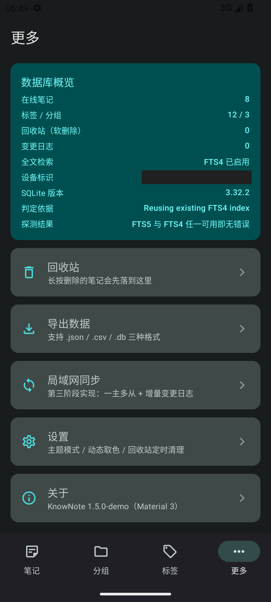

# KnowNote

**English** · [中文](README.md)

An Android notebook for small, scattered knowledge — the kind of thing you jot down in ten seconds and need to find again six months later.

Notes + tags + groups, full-text search over the note body, Markdown preview, a trash bin with scheduled cleanup, and **LAN sync between your own devices** — no account, no cloud. Sync can run **on a schedule**: either the phone pushes in the background (WorkManager), or a small **sync hub that runs on Termux** (pure Python 3, zero dependencies) polls your devices on its own timer.

| | |
| --- | --- |
| **Language** | Kotlin 2.0 · Jetpack Compose · **Material 3** |
| **Data** | Room (SQLite) + FTS5 / FTS4 / LIKE three-level fallback |
| **Architecture** | MVVM + Repository, manual DI (`AppViewModelProvider`) |
| **SDK** | minSdk 26 · targetSdk 36 |
| **UI languages** | 简体中文 · 繁體中文 · English · 日本語 |

> 界面截图见 [`docs/screenshots/`](docs/screenshots/)（模拟器 + 演示数据；同步页的共享密钥 / 设备标识 / 局域网地址已打码）

## What it does

- **Notes with real search.** Chinese substring search that actually works (see *The FTS5 story* below), tags folded into the index, hit highlighting, search history.
- **Search you can aim.** Limit a query to title, body or tags (all three by default); the candidate set widens automatically when you narrow, so filtering never hides results.
- **Case-insensitive everywhere.** Index and query both fold with `lowercase(Locale.ROOT)`, so `Android`, `android` and `GRADLE` hit the same note; search history merges duplicates case-insensitively too.
- **Reading display.** Five text sizes (the whole Typography scales proportionally, so the heading/body hierarchy survives) and seven text colours with separate light and dark values.
- **Reading your way.** A slider on the note page sets the reading size (0.8×–1.8×, showing the resulting sp value) and you can switch between rendered Markdown and the raw text — handy when hand-editing markup. Both are stored as a ratio, so the global text size and the reading slider never fight each other.
- **Inline formatting.** Select text in the editor to make it **bold**, *italic*, one of three sizes, or one of six colours (red/yellow/green/cyan/blue/purple). It is stored as `<color=red>…</color>` / `<size=1.25>…</size>` inside the plain body; sizes are relative (em) so they stack with the reading slider, and every colour has a light and a dark variant.
- **Images in the body.** The editor inserts a picture through the system photo picker (no storage permission). The file is copied into app-private storage, downscaled to 1600px and re-encoded as JPEG; the plain body only stores ``. Rendering works block by block, so an image always takes a full-width line of its own — even one inserted mid-sentence. Card summaries show `[caption]` instead of the raw markup. Images travel with **LAN sync** too (each one is sent once; oversized batches are split across rounds). Export still carries the reference only.
- **Three ways to organise.** Tags, groups, and combined filtering; tapping a tag or group opens a dedicated page with the same card layout and list ↔ staggered-grid toggle.
- **Never lose a note.** Long-press deletes, everything lands in Trash first, and cleanup is opt-in: WorkManager runs once a day, keeps 7/30/90 days, and reports back what it removed.
- **Reads like notes should.** Tap = preview (Markdown rendered), long-press = edit. Only saves when you actually changed something.
- **Sync between your own devices.** One device hosts, the others pull: incremental changes via a change log + watermark, timestamps decide conflicts, ties converge deterministically.
- **Sync on a schedule.** Flip one switch and the phone pushes in the background (15/30/60/180 min); or run the bundled **sync hub on Termux** so the server side does the polling and the phone needs nothing running at all. Sync is **LAN-only**: it never starts on mobile data, a public peer address is refused, and the hub rejects any source outside your local network.

## Screenshots

| Notes | Editor | Search | Settings |
| --- | --- | --- | --- |
|  |  |  |  |

| Groups | Group detail | Stats | English UI |
| --- | --- | --- | --- |
|  |  |  |  |

## Build & run

```bash
# JDK 17 + Android SDK (point local.properties at your SDK; it is not committed)
./gradlew :app:assembleDebug            # app/build/outputs/apk/debug/app-debug.apk
./gradlew :app:installDebug             # install on a connected device
./gradlew :app:testDebugUnitTest        # unit tests (62)
./gradlew :app:connectedDebugAndroidTest # instrumented tests (50, needs a device/emulator)

# Sync hub (the server side; runs on Termux or any PC, Python 3 standard library only)
python -m unittest discover -s server/tests -t .   # 41 hub tests, real sockets
python server/knownote_hub.py --init-config server/hub.conf.json   # write a config (random key)
python server/knownote_hub.py --config server/hub.conf.json        # serve + poll devices on a timer
```

> The wrapper's `distributionUrl` points at a Huawei mirror — `services.gradle.org` times out on
> direct connections from mainland China. Regenerate with
> `gradle wrapper --gradle-distribution-url https://mirrors.huaweicloud.com/gradle/gradle-8.13-bin.zip`

## Architecture

```
data/model/Entities.kt       notes / tags / groups / note_tags / sync_meta / change_log / search_history / sync_log
data/db/AppDatabase.kt       8 tables (schema v3) + MIGRATION_1_2 / 2_3 + FTS bootstrap & self-healing
data/db/FtsStore.kt          virtual-table DDL, engine probing, MATCH queries, index rebuild
data/fts/FtsText.kt          tokenisation and MATCH expression building (the key to Chinese substring search)
data/repo/NoteRepository.kt  the only write path: note + relations + FTS index + change log in one transaction
data/export/Exporter.kt      JSON / CSV / SQLite (VACUUM INTO) export through SAF
data/sync/…                  wire format, engine, hand-written HTTP server, client, coordinator
data/sync/AutoSync.kt        scheduled sync on the device (WorkManager worker + scheduler)
server/knownote_hub.py       sync hub: protocol-v2 host + device poller + SQLite/images (runs on Termux)
server/start-hub.sh          start / background / wake-lock / status / log / stop
data/settings/AppSettings.kt reactive settings (theme / dynamic colour / trash cleanup / language)
ui/…                         Compose screens + ViewModels
```

## Two Android platform gotchas worth knowing

Both found on a real device, both fixed in the code rather than worked around.

**1. Android's bundled SQLite does not guarantee FTS5.** On Android 15 / SQLite 3.44.3, `fts5` reports
`no such module`. The app therefore probes for capability and falls back FTS5 → FTS4 → LIKE, showing the
active engine in the UI so degradation is never silent.

The trap: you cannot probe with `CREATE VIRTUAL TABLE IF NOT EXISTS … USING fts5`, because when a table
of that name already exists SQLite skips module loading and reports success — the app then believes it has
FTS5 and every `bm25()` query returns nothing. The fix is to judge by *behaviour*: try a `MATCH` to see
whether the module is there, use `bm25()` to tell FTS5 from FTS4, and keep all probing inside `temp.`
tables so a failed `CREATE` can never leave debris behind.

**2. FTS4 without `SQLITE_ENABLE_FTS3_PARENTHESIS` treats `AND` as a literal token.** `"检 索" AND "零 碎"`
matches nothing. The app uses whitespace as implicit AND instead — valid on both FTS4 and FTS5.

For Chinese, `unicode61` treats a run of Han characters as one token, so searching 「检索」 never finds
「全文检索」. Rather than shipping a dictionary segmenter, the index stores a per-character copy of CJK
text (`全文检索` → `全 文 检 索`) and queries turn adjacent CJK into a phrase, so substring matching works
with the stock SQLite.

## LAN sync

Host device runs an embedded HTTP server (default port 8765); clients fill in *address + shared key* and
press sync. One request carries both directions.

- `GET /ping` — reachability probe, no key required, returns `{protocol, device_name}`. Exists so you can
  tell "wrong address" apart from "wrong key".
- `POST /sync` — `X-KnowNote-Key` header, request carries the client's watermark + its own changes,
  response carries the host's changes.

The wire format never contains local row ids: notes are identified by a `guid`, groups and tags by **name**,
so no id-mapping table is needed. Conflicts go to the newer `updated_at`; equal timestamps resolve to the
larger canonical string so both sides converge instead of fighting forever.

**The difference itself is computed from a full inventory (v1.10.2, protocol 3).** Every round carries each
side's *inventory* — `guid`, `updated_at`, the tombstone bit and a content fingerprint (wire keys
`g/u/p/h`), never the body — and both ends run the same pure function (`SyncDiff` in Kotlin and in the hub,
bit-identical) to derive *what to send* and *what to ask for*. A body travels only when the other side names
its guid in `want_guids`, so a normal exchange is either one round (nothing differs) or two (diff, then the
bodies that were named). The watermark survives as a one-round shortcut and a UI readout: **correctness no
longer depends on it** — a peer swap, a stale watermark or skewed clocks cannot drop notes. That is exactly
the bug this replaced: the old watermark-only inference gave a brand-new peer only a handful of notes when
the old device's watermark had already been advanced by a *different* peer.

**"Delete permanently" leaves a tombstone** (`is_purged = 1`) rather than removing the row — otherwise the
other device would happily sync the note back.

**Security boundary, stated plainly:** the key decides *who may sync*, not *who can read*. Transport is
plain HTTP on the LAN, and a host without a key refuses to start. Requesting a note from someone on the
same Wi-Fi is possible; hiding its content until TLS lands is not. The host also has no foreground
service in this version, so the process can be reclaimed by the system.

**And sync is LAN-only (v1.10.1).** Three choke points, each at the only entrance:
the app as a *client* never starts when the active network is not a local one (mobile data) or when the
peer address is not in a private range — not a single request leaves the device; the app as a *host*
answers 403 to any connection from outside the LAN (the page shows how many were refused); the hub
(`lan_only`, on by default) rejects non-private sources and, for anything arriving through a tunnel or
reverse proxy, judges the real origin in `CF-Connecting-IP` / `X-Real-IP` / `X-Forwarded-For`. A hub whose
`bind` resolves only to public addresses — or a machine with no LAN address at all — refuses to start
(exit code 2). The periodic job's network constraint is `UNMETERED`, so the phone is not even woken on
cellular. Being blocked is reported as *skipped*: never `retry` (battery) and never `failure` (that would
cancel the periodic work). Note the deliberate exclusion: carrier-grade NAT `100.64.0.0/10` counts as
*outside* the LAN, because that is exactly where a phone on mobile data lives. This boundary filters by
source network, not by identity — for confidentiality over an untrusted path you still need TLS.

### Scheduled sync: two places it can live

| | On the phone (`data/sync/AutoSync.kt`) | On the hub (`server/knownote_hub.py`) |
| --- | --- | --- |
| Who starts it | the phone, via a WorkManager periodic job | the hub, connecting to each device |
| Shortest interval | **15 minutes** (Android's hard floor), later still under Doze | whatever you configure (60 s by default) |
| Needs | just a correct *address + key*, peer may be asleep | the phone must be in **host mode** with the app alive |

Run both and whichever fires first wins — sync is idempotent, so a redundant round costs nothing.
Two traps worth knowing (both pinned by regression tests): a worker that returns `failure` gets its
**periodic work cancelled** by WorkManager (so a missing address is reported as success and retried next
cycle, never as failure), and manual + scheduled syncs must not interleave on the single
`sync_meta.last_sync_at` watermark (a mutex serialises the sessions). Turning the switch on also runs one
sync immediately, through the very same code path the background worker uses.

### The Termux sync hub (`server/`)

A long-running hub that is both a **host** (speaks exactly the app's protocol v2, so the phone just fills
in *address + key* — no app changes) and a **poller** (connects to every configured device on
`interval_seconds`, which is the server-side scheduling). Pure Python 3 standard library — no packages,
no compiler, no root, no foreground service:

```bash
cd server
python knownote_hub.py --init-config hub.conf.json   # random key included
vim hub.conf.json                                    # list your devices: LAN IP + port + key
bash start-hub.sh bg                                 # run in the background (pid + log)
bash start-hub.sh status                             # notes stored, last result per device
bash start-hub.sh check                              # reachability only, touches no data
bash start-hub.sh log | stop
```

Also available: `--once` (one polling round then exit — cron / Termux:Boot friendly), `--status`,
`--check`, `--port`, `--key`, `--print-key`. `hub.conf.json`, the database and `images/` are git-ignored
(they hold your key and your notes). Boundaries: the hub does keep its own copies — notes, change log,
images, each device's watermark, its last sync result and a cache of what each peer last advertised; the
cache is only a hint that saves a round, because every round re-reads what the peer advertises, so
restarting or wiping the hub cannot make two devices misremember each other. It requires a key to start,
**it serves the local network only** (`lan_only`, on by default: non-private sources get 403, tunnels are
judged by the real origin header, and a public `bind` refuses to start), its transport is **plain HTTP**
like the app host, and it is a single-process server — fine for a handful of devices, not a public relay.

## Verification

| Check | Result |
| --- | --- |
| `assembleDebug` / `assembleRelease` | BUILD SUCCESSFUL |
| Unit tests | **58/58** (v1.10.1; 55 before; `LanAddressTest` adds 3 — and writing it immediately caught that `[fd00::1]:8765`, the bracketed IPv6 form, was not handled: fixed) |
| Instrumented tests (Android 13 / SQLite 3.32.2, emulator) | **57/57** (52 before; see the v1.10.2 rows below) |
| Instrumented tests (Android 15 / SQLite 3.44.3, emulator) | **57/57** |
| LAN-only: "not a single request" is actually verified | the instrumented test asserts the **host received 0 requests**, not just the return value — an empty session also "succeeds", so asserting the result alone proves nothing |
| LAN-only: *skipped*, never *retry* or *failure* | blocked runs return `success` and record `skipped:` — `retry` would burn battery backing off while away from home, `failure` would cancel the periodic work (the v1.10.0 pitfall) |
| LAN-only: not even woken on cellular | the periodic work's constraint is asserted to be `NetworkType.UNMETERED`, and the self-heal enqueue now uses `UPDATE` (with `KEEP` the constraint already scheduled on an existing install never changes) |
| LAN-only: a 403 changes nothing | note count and content hash are identical before and after a rejected request (not "answered 403 after writing") |
| LAN-only: source judgement (hub) | direct public address → 403; public `CF-Connecting-IP` → 403; multi-hop `X-Forwarded-For` → first hop only; private addresses pass; `lan_only:false` passes; a public `bind` makes `main()` return 2 |
| LAN-only: same address definition on both sides | RFC1918 + loopback + link-local + IPv6 (`::1`, `fc00::/7`, `fe80::/10`), and both sides **deliberately exclude** `100.64.0.0/10` — that is exactly where a phone on mobile data lives |
| UI on the real tablet | the new hint under the client block and the host card's "refused N connections from outside the LAN" were both checked on the real tablet; four languages, no layout breakage |
| Overwrite install (tablet, Android 16 / SDK 36) | 1.10.0 → 1.10.1 in place, backed up first: `user_version` 3 and every count (notes / tags / groups / change log) **identical**, the `notes` content hash unchanged, preference file and images byte-identical, `firstInstallTime` unchanged (only `lastUpdateTime` moved), the launch counter matches the real number of notes |
| Real tunnel check (closest to "someone actually connecting from outside") | pointed the home Cloudflare tunnel (`example.com`) at the hub and hit it for real: with `lan_only:true`, `https://example.com/ping` returned **403**, the hub logging *refusing a request from outside the local network: the real origin in the proxy header, 203.0.113.7, is not on the local network*. The tunnel reports the connection as coming from 127.0.0.1 while the real client sits in `CF-Connecting-IP`, and that header is exactly what gets judged. With `lan_only:false` the same URL returned **200** — the control proving the rule, not something else, is what blocked it. Temp config deleted afterwards, the tunnel config is back to its original target |
| Diff over real sockets (v1.10.2, protocol 3): hub ⇄ hub | Termux hub (fresh DB) pulled **3 notes** in round 1, then `0/0` in **1 round** (inventories identical); a note created on the Termux side was then pushed as `1` in 2 rounds — one to name it, one to send it. Over the real LAN (192.168.1.7 ⇄ 192.168.1.9), two independent Python hubs |
| Diff over real sockets (v1.10.2, protocol 3): hub ⇄ real app | `--check` → `✓ Android 模拟器, protocol 3`; polling the app's host mode through `adb forward`: the app **named the hub's 2 notes in `want_guids`** and received them in round 2 (checked inside the app's own DB: `user_version` 3, both `pc-to-app-*` rows present, its `sync_log` reads `host · 推 2`), then a steady `0/0` in 1 round |
| Unit tests | **62/62** (58 before; `SyncDiffTest` adds 4: peer missing / local newer / timestamp tie with a different fingerprint / tombstones, plus the pinned hash values) |
| Instrumented tests (Android 13 / Android 15) | **57/57** (52 before; 5 new: a fresh host still receives the whole library when the client's watermark was already advanced, a deletion travels with no pending delta, wire-struct round trip, and the golden-JSON contract below) |
| The two implementations' fingerprints must agree bit for bit | `fnv1a32` is asserted with the same input and the same expectation in Kotlin and in Python (`551d9a74`, `04a770bf`). One bit off and both sides believe "content differs" forever, re-sending bodies every round |
| The two implementations' key names must agree character for character | one golden JSON, half-pinned on each side: Python asserts its generator emits exactly that string, Kotlin asserts that string parses into inventory / want_guids / notes. This covers the one direction a live run cannot reach (the app as *client* reading the hub's response) |
| A bug found while verifying the above | protocol 3's `inventory` / `want_guids` had been added to the *request* parser but forgotten in the hub's response parser. Not wrong data — a whole-library re-send every round, visible as "5 rounds" in the real Termux ⇄ PC hub log. Fixed; the steady state is back to 1 round, with two regressions added (wire-struct round trip + explicit round-count assertions) |
| The v1.10.1 LAN guard still holds | on an emulator with only mobile data available, the app recorded `Sync blocked: the device is not on a local network (mobile data?)` — and sent **not a single request** |
| Hub tests (`python -m unittest discover -s server/tests`) | **50/50**: protocol (401 / 404 / 429 throttle / bad JSON / protocol version over real HTTP), engine (increments, conflict convergence, tombstones, images sent once, multi-round), polling (two-way, idempotent, failure reasons, watermark = min clock), persisted device state, LAN-only enforcement (public sources and public peers behind proxy headers get 403 without touching any data, private sources pass, the switch turns it off, a public `bind` refuses to start) |
| Cross-implementation ①: hub polls the app | hub `--check` → `✓ Android 模拟器, protocol 2`; one `--once` round **pulled 8 notes from the app and pushed 2 back**; app DB 8 → 10 notes with groups/tags matched by name |
| Cross-implementation ②: app syncs to the hub | a note created on the hub appeared on the emulator after flipping the *Scheduled auto sync* switch (10 → **11 notes**, card shows "last auto sync: just now · success"); the app pushed its 10 notes and the hub applied 0 — idempotent convergence |
| Hub tests **on a real Termux** (Android 11 手机, Termux's own Python 3.14.6, arm64) | **50/50 OK** — no dependencies, no compiling: `pkg install python`, then `python3 -m unittest discover -s tests -t .`, no root and not a single third-party package |
| Cross-implementation ③: Termux hub ⇄ PC hub | both hubs see protocol 2; the Termux side pulled **12 notes** in one round and `0/0` the next (idempotent); `--status` shows `已同步过 …` |
| Cross-implementation ④: Termux hub ⇄ the real app | the hub inside the phone's Termux reached the app (`Android 模拟器, protocol 2`), pulled 10 notes, then **pushed a note it had created itself** into the app (12 → 13 notes; the app's own sync log lists `Termux Hub (Android 11 手机) · 拉取 0 条 · 推送 1 条`). Full chain = Python in Termux on a real phone ⇄ a real Android app, over the same protocol |
| Device state persisted for `--status` | the hub's `--status` (a separate process) reports `已同步过（…拉 11 / 推 0）` instead of the old always-"never synced" |
| Migration tests | 1→2 (adds `search_history`), 2→3 (`guid` backfill via `randomblob(16)`, `is_purged`, `sync_log`), 1→3 jump; each validated against the exported Room schema |
| Real-device sync loopback | real `ServerSocket` + real `HttpURLConnection`, two independent databases, two-way sync, wrong key → 401 |
| Multi-language | switching to English/Japanese re-renders the whole UI, numbers included; system per-app locale stays in sync |

## Version history

| Version | Notes |
| --- | --- |
| v1.0.0 | First working version: notes, tags, groups, FTS with fallback, export, trash |
| v1.0.1 | Fixed FTS engine mis-detection; repeat probing is now idempotent |
| v1.1.0 | Markdown rendering, edit ↔ preview, search history, filter memory, trash; database migration 1→2 |
| v1.1.1 | Fixed tags typed but not confirmed being dropped; tap = view / long-press = edit; list ↔ staggered grid |
| v1.2.0 | Tag and group entries open their notes (first attempt: inline expansion) |
| v1.2.1 | Second-level pages instead: `group/{id}` and `tag/{id}` routes, own filter box, same cards; fixed a real bug where merely previewing a note bumped `updated_at` |
| v1.3.0 | LAN sync: host + clients, hand-written HTTP server, incremental changes, deterministic conflict resolution, shared-key auth; database migration 2→3 |
| v1.4.0 | Settings page (theme mode, dynamic colour, scheduled trash cleanup); overview counters became Room Flows so they update live |
| v1.5.0 | Four UI languages with per-app locale support; renamed to **KnowNote / 碎片笔记**; adaptive icon with a proper monochrome layer; internal diagnostics unified to English. Also fixed a bug only visible on a device: Kotlin templates in *translations* were written into resources verbatim, so the Japanese UI showed `$days 日` |
| v1.6.0 | Adjustable reading display (five sizes, seven text colours) and a search you can aim (title / body / tags, all by default; case-insensitive everywhere). The text colour has to be applied to **theme colour roles**, not `LocalContentColor` — 60+ Texts set an explicit colour, so only roles take effect |
| v1.7.0 | Per-page reading controls (size slider as a ratio, markdown ↔ raw text) and inline formatting in the editor (bold / italic / three sizes / six colours, stored as `<color>` / `<size>` tags in the plain body). The renderer now parses nested inline tokens — bold-outside-colour used to leak the tags as literal text. Unit tests 16 → **38** |
| v1.8.0 | **Images in the note body**: pick from the gallery, copied into app-private storage (downscaled and re-encoded), referenced as ``. The renderer splits content into text and image blocks so an image always occupies a full line of its own; summaries show `[caption]`. Known gap: images do not travel through export or LAN sync yet |
| v1.9.0 | **Images join LAN sync**: protocol bumped to 2; images ride along with the notes in the same request (base64, max 6 images / 4 MB per batch) and oversized sets are split across rounds automatically. Each device remembers what the peer already has, so a file is sent once; sync log reports image counts |
| v1.10.1 | **LAN-only sync**: enforced in three places — the app as a client (never starts on mobile data or towards a public peer; not a single request leaves the device), the app as a host (a connection from outside the LAN gets 403, and the page shows how many were refused), and the hub (`lan_only`, on by default: non-private sources get 403, tunnels are judged by the real origin in `CF-Connecting-IP` / `X-Forwarded-For`, and a public `bind` or a machine with no LAN address refuses to start). The periodic job's network constraint tightened from *any network* to `UNMETERED`, and it now uses `UPDATE` so the new constraint actually replaces the one already scheduled on existing installs. Being blocked counts as *skipped*, never as retry or failure (a failing periodic job gets cancelled — the pitfall v1.10.0 documented). Four languages, unit + instrumented tests |
| v1.10.2 | **Sync becomes a two-way inventory diff (protocol 3)** — fixes the real-device bug where a brand-new peer received only a handful of notes. The difference used to be *inferred* from a change log + watermark, and the watermark means "where I got to with the *previous* peer", so an old device reaching a new peer computed an empty delta. Now every request and response carries a full **inventory** (`guid` + `updated_at` + tombstone bit + content fingerprint, never the body), both ends derive the difference with the same pure function (Kotlin's `SyncDiff` and the hub's, bit-identical), and a body only travels after the peer names its guid in `want_guids`. The watermark is demoted to a one-round shortcut and a UI readout — **correctness no longer depends on it** |
## Roadmap

1. **Harden sync** — foreground service with a persistent notification for the host (less urgent now that the
   hub can poll devices on its own timer), TLS or a pre-shared key for confidentiality (both the app host
   and the hub still speak plain HTTP — LAN-only filtering decides *where* traffic may go, not whether it
   can be read in transit), optional static addressing instead of typed-in IPs.
2. **Device discovery** — NSD/mDNS so the address box is not needed.
3. **Conflict UX** — list which notes were resolved (and offer a "see the other side" view).
4. **Export** — range selection (group/tag/time) and import.
5. **Tombstones** — purge tombstones once every peer's watermark has passed them.

## License

[MIT](LICENSE) — use it, change it, ship it; just keep the copyright notice.

---

Built with Kotlin, Compose and a lot of on-device testing — every "verified" row above was run on a real
phone, not just in CI.
